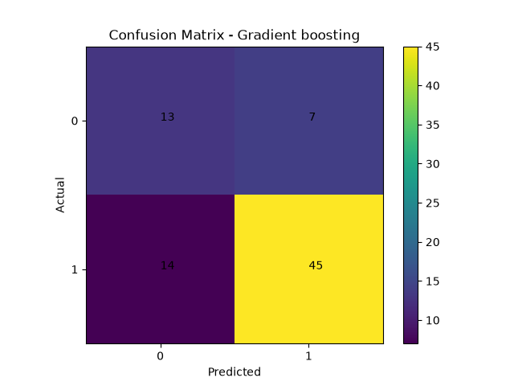

## XGBOOST Classification from scratch

This project implements XGBoost classification from scratch without relying on machine learning libraries for the core algorithm.
The implementation is validated by comparing its performance with xgb's `XGBClassifier` on the student score dataset.

### Features 

* XGBoost classification implemented from scratch.
* weight calculation
* Threshold generation 
* Data splitting 
* gain calculation
* Best gain, gradient, hessian,feature,thresholds
* Recursive tree construction
* Pure-node detection
* weight based prediction
* max_depth for controlling tree growth
* intial prediction
* sigmoid conversion
* calculating gradient,hessian
* prediction upadation
* recalculating gradient,hessian values.
* store trees
* predict on test data using trained trees.

### Dataset

student-mat.csv

Source:

UCI Machine Learning Repository

### Algorithm

XGBoost is supervised machine learning algorithm based on gradients, hessian, regularization.

The algorithm calculates the target value by continuesly creating trees with correction of previous trees without adding too much split complexity.

### Prediction 

```text
Fm(x) = Fm-1(x) + ηTm(x)
```
* Fm−1(x) = previous ensemble prediction
* Tm(x) = new tree's prediction
* η = learning rate

### Gradient

```text
dL/dF = F - y
- dL/dF = y - F
```

### Hessian 

### Gradient

```text
dg/dF = F 
```

### weight
### Gradient

```text
w = -G / (H + λ)
G = sum(g)
H = sum(h)
λ = regularization parameter
```

## Implementation

* Loaded student score dataset.
* selected the useful features.
* modified the target.
* split the data into training and testing.
* Calculated weight for each leaf node.
* split based on thresholds.
* Calculated gain based on candidate split.
* Selected the split with maximum gain.
* Recursively constructed the decision tree.
* Used the mean target value as the prediction at leaf nodes.
* Added maximum depth
* created intial predictions.
* convereted into sigmoid probability.
* use the probability calculate the gradients and hessian.
* update the prediction.
* recaluculating gradients and hessians.
* use the stored trees to predict for unseen data.
* check the accuracy.
* evaluated using precison,recall,confusion matrix.
* compared with libraries implementation.
* Added visualization confusion matrix.

### from scratch

```text
accuracy: 74.68354430379746
Precision: 0.7758620689655172
recall: 0.8653846153846154
Confusion Matrix: 
[[14 13]
 [ 7 45]]
```

### Scikit-learn

```text
Accuracy: 0.7341772151898734
Precision: 0.7627118644067796
recall: 0.8653846153846154
Confusion Matrix: 
[[13 14]
 [ 7 45]]

```

### Visualizations

### confusion matrix




## Folder Structure

```text
XGBoost_classification/
│
├── plots/
│   ├── confusion_matrix.png
│
├── from_scratch.py
├── sklearn_model.py
├── visualization.py
└── README.md
```

### What I learned
* Implemented XGBoost classification from scratch.
* Learned how to train model using xgboost algorithm.
* Learned the difference between classification and regression implementation.
* Learned to get better model, good dataset also essential as good algorithm.
* Learned manual implementation takes more time to run program compare with libraries.
* Learned with poor datasets library models also perform poor without normalizing data.
   
